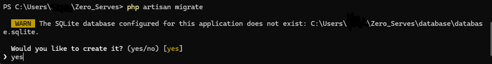

# 🍽️ ZeroServes - Restoran Yönetim Sistemi

<div align="center">
  
  
  
  
</div>

## 📋 Proje Hakkında

**ZeroServes**, modern restoran işletmeleri için geliştirilmiş kapsamlı bir yönetim sistemidir. QR kod tabanlı sipariş sistemi, çoklu kullanıcı rolleri, gerçek zamanlı stok takibi ve gelişmiş oturum yönetimi ile restoran operasyonlarını dijitalleştirir.

### 🎯 Ana Özellikler

-   **QR Kod Sipariş Sistemi**: Müşteriler masalarındaki QR kodları okutarak doğrudan sipariş verebilir
-   **Çoklu Kullanıcı Sistemi**: Admin, garson ve müşteri panelleri aynı anda kullanılabilir
-   **Gerçek Zamanlı Stok Takibi**: Otomatik stok güncelleme ve düşük stok uyarıları
-   **Rezervasyon Yönetimi**: Online rezervasyon sistemi ve admin onay süreci
-   **Garson Çağrı Sistemi**: Müşteriler garsonları çağırabilir, garsonlar yanıtlayabilir
-   **Gelişmiş Oturum Yönetimi**: 30 dakika timeout, CSRF koruması, çoklu oturum desteği
-   **Raporlama ve Analitik**: Detaylı satış raporları ve performans analizi

## 🏗️ Sistem Mimarisi

### Teknoloji Stack

-   **Backend**: Laravel 12.x (PHP 8.2+)
-   **Frontend**: Blade Templates, TailwindCSS, JavaScript
-   **Veritabanı**: SQLite (geliştirme), MySQL/PostgreSQL (production)
-   **QR Kod**: SimpleSoftwareIO QR Code
-   **PDF**: DomPDF
-   **Session**: Laravel Session Management

### Veritabanı Yapısı

```
📊 Ana Modeller:
├── Users (Admin, Waiter, Customer)
├── Tables (Masa yönetimi + QR kodlar)
├── Products (Ürün kataloğu + stok takibi)
├── Categories (Ürün kategorileri)
├── Orders (Sipariş yönetimi)
├── OrderItems (Sipariş detayları)
├── Reservations (Rezervasyon sistemi)
├── WaiterCalls (Garson çağrı sistemi)
├── Payments (Ödeme takibi)
└── OrderStatusLog (Sipariş durum geçmişi)
```

## 🚀 Kurulum

### Gereksinimler

-   PHP 8.2 veya üzeri
-   Composer
-   Node.js & NPM
-   SQLite/MySQL/PostgreSQL

### Adım 1: Projeyi Klonlayın

```bash
git clone https://github.com/kullanici/zeroserves.git
cd Zero_Serves
```

### Adım 2: Bağımlılıkları Yükleyin

```bash
# PHP bağımlılıkları
composer install
```

Eğer eksik uzantı hatası alırsanız (örneğin, ext-gd):

1. php.ini dosyasını açın (örneğin, XAMPP için C:\xampp\php\php.ini).
2. ;extension=gd satırındaki ; işaretini kaldırarak extension=gd yapın.
3. Web sunucusunu (Apache/Nginx) yeniden başlatın.
4. Gerekirse bağımlılıkları güncelleyin:

```bash
composer update
composer install
```

### Adım 3: Ortam Dosyasını Hazırlayın

Ortam dosyasını kopyalayın ve uygulama anahtarını oluşturun:

```bash
copy .env.example .env
php artisan key:generate --ansi
```

### Adım 4: Veritabanını Hazırlayın

SQLite için:

1. database/database.sqlite dosyasını oluşturun. (Eğer dosya yoksa migration sırasında Artisan otomatik olarak soracaktır, yes diyebilirsiniz.)
2. Migration’ları çalıştırın:

```bash
php artisan migrate
```



4. Demo verileri yüklemek için (isteğe bağlı):

```bash
php artisan db:seed
```

MySQL/PostgreSQL için:

-   .env dosyasında DB_CONNECTION, DB_HOST, DB_PORT, DB_DATABASE, DB_USERNAME ve DB_PASSWORD ayarlarını yapılandırın.
-   Migration’ları çalıştırın:

```bash
php artisan migrate
```

### Adım 5: Storage Link ve Cache Temizleme

Depolama bağlantısını oluşturun ve önbelleği temizleyin:

```bash
php artisan storage:link
php artisan optimize:clear
```

### Adım 6: Uygulamayı Başlatın

Geliştirme sunucusunu başlatın:

```bash
php artisan serve --host=127.0.0.1 --port=8000
```

Uygulama artık http://127.0.0.1:8000 adresinde çalışacaktır.


## Sık Karşılaşılan Hatalar

-   **ext-gd Hatası:** php.ini dosyasında extension=gd satırını aktifleştirin ve sunucuyu yeniden başlatın.
-   **SQLite Dosyası Bulunamadı:** database/database.sqlite dosyasını manuel olarak oluşturun veya php artisan migrate sırasında Artisan’ın otomatik oluşturma önerisini kabul edin (yes).
-   **Bağlantı Hatası:** .env dosyasındaki veritabanı ayarlarını kontrol edin.

## 📧 Mail Yapılandırması

ZeroServes, rezervasyon bildirimleri ve diğer e-posta işlemleri için SMTP tabanlı bir mail sistemi kullanır. .env dosyasında mail ayarlarını yapılandırmanız gerekir.

### 1) Gmail için Yapılandırma

Gmail kullanmak için bir App Password oluşturmanız gerekiyor:

1. Gmail hesabınızda İki Adımlı Doğrulama’yı etkinleştirin.
2. Google Hesap Ayarları → Güvenlik → Uygulama Şifreleri bölümüne gidin.
3. Yeni bir uygulama şifresi oluşturun ve 16 haneli şifreyi not edin.

.env dosyasına aşağıdaki ayarları ekleyin:

```ini
MAIL_MAILER=smtp
MAIL_HOST=smtp.gmail.com
MAIL_PORT=587
MAIL_USERNAME=your-email@gmail.com
MAIL_PASSWORD=your-app-password
MAIL_ENCRYPTION=tls
MAIL_FROM_ADDRESS=your-email@gmail.com
MAIL_FROM_NAME="ZeroServes"

```

### 1) Mail Testi

Mail yapılandırmasını test etmek için:

```bash
php artisan mail:send-test --to=test@example.com
```

**Not: Mail gönderimi çalışmıyorsa, .env dosyasındaki ayarları kontrol edin ve internet bağlantınızı doğrulayın.**

## 👥 Kullanıcı Rolleri ve Paneller

### 🔐 Admin Paneli (`/admin`)

**Erişim**: `admin@example.com` / `password`

**Özellikler**:

-   📊 Dashboard ve istatistikler
-   🍽️ Menü yönetimi (kategori + ürün)
-   🪑 Masa yönetimi ve QR kod oluşturma
-   📋 Sipariş takibi ve durum güncelleme
-   👥 Kullanıcı yönetimi
-   📦 Stok takibi ve uyarılar
-   📅 Rezervasyon onay/red sistemi
-   📈 Raporlama ve analitik

### 🍽️ Garson Paneli (`/waiter`)

**Erişim**: `waiter@example.com` / `password`

**Özellikler**:

-   📋 Atanan masaları görüntüleme
-   🛒 Sipariş durumu güncelleme
-   📞 Garson çağrılarını yanıtlama
-   💰 Ödeme işlemleri
-   📊 Günlük performans takibi

### 🏠 Müşteri Paneli (QR Kod)

**Erişim**: Masa QR kodunu okutarak

**Özellikler**:

-   📱 Mobil uyumlu menü görüntüleme
-   🛒 Sepete ürün ekleme/çıkarma
-   📞 Garson çağırma
-   💳 Sipariş verme
-   📋 Sipariş takibi

## 🔧 Ana Özellikler Detayı

### 1. QR Kod Sipariş Sistemi

-   Her masa için benzersiz QR kod
-   Müşteriler QR kodu okutarak menüye erişir
-   Sepet sistemi ile sipariş oluşturma
-   Gerçek zamanlı fiyat hesaplama

### 2. Çoklu Oturum Yönetimi

-   **3 ayrı guard sistemi**: admin, waiter, customer
-   **30 dakika timeout**: İnaktivite sonrası otomatik çıkış
-   **CSRF koruması**: Otomatik token yenileme
-   **Tarayıcı kapanma algılama**: 2 dakika sonra oturum sonlandırma

### 3. Stok Yönetimi

-   **Otomatik stok güncelleme**: Sipariş sonrası stok azaltma
-   **Düşük stok uyarıları**: Kritik seviye bildirimleri
-   **Stok geçmişi**: Tüm stok hareketlerinin takibi
-   **Toplu stok güncelleme**: CSV import/export

### 4. Rezervasyon Sistemi

-   **Online rezervasyon formu**: Müşteri bilgileri + tarih/saat
-   **Admin onay süreci**: Rezervasyonları onaylama/reddetme
-   **E-posta bildirimleri**: Onay/red durumu bildirimi
-   **Rezervasyon takibi**: Durum ve not yönetimi

### 5. Garson Çağrı Sistemi

-   **Müşteri çağrısı**: Masadan garson çağırma
-   **Garson yanıtı**: Çağrıları görüntüleme ve yanıtlama
-   **Durum takibi**: Beklemede/Yanıtlandı/Tamamlandı
-   **Bildirim sistemi**: Gerçek zamanlı uyarılar

## 📱 API Endpoints

### Session Management

```
GET  /api/csrf-token          # CSRF token al
GET  /api/session/status      # Oturum durumu kontrol
POST /api/session/heartbeat   # Aktivite bildirimi
POST /api/session/browser-close # Tarayıcı kapanma bildirimi
```

### Order Management

```
GET  /admin/orders            # Sipariş listesi
POST /admin/orders/{id}/status # Sipariş durumu güncelle
GET  /admin/orders/{id}       # Sipariş detayı
```

### Table Management

```
GET  /admin/tables            # Masa listesi
POST /admin/tables            # Yeni masa oluştur
GET  /admin/tables/{id}/qr    # QR kod oluştur
```

## 🛠️ Geliştirme

### Veritabanı Migration'ları

```bash
# Yeni migration oluştur
php artisan make:migration create_example_table

# Migration'ları çalıştır
php artisan migrate

# Migration'ı geri al
php artisan migrate:rollback
```

### Model ve Controller Oluşturma

```bash
# Model oluştur
php artisan make:model ExampleModel -m

# Controller oluştur
php artisan make:controller ExampleController

# Resource controller oluştur
php artisan make:controller ExampleController --resource
```

### Frontend Geliştirme

```bash
# CSS/JS dosyalarını derle
npm run dev

# Production build
npm run build

# Watch mode (geliştirme)
npm run dev -- --watch
```

## 🧪 Test Etme

### Unit Testler

```bash
php artisan test
```

### Feature Testler

```bash
php artisan test --testsuite=Feature
```

## 📊 Performans Optimizasyonları

### Veritabanı Optimizasyonları

-   **Eager Loading**: N+1 sorgu problemini önleme
-   **Index'ler**: Sık kullanılan kolonlarda index
-   **Query Optimization**: Tek sorguda çoklu veri çekme
-   **Caching**: Redis/Memcached ile cache sistemi

### Frontend Optimizasyonları

-   **Lazy Loading**: Görüntülerin gecikmeli yüklenmesi
-   **CSS/JS Minification**: Dosya boyutlarını küçültme
-   **CDN Kullanımı**: Statik dosyalar için CDN
-   **Progressive Web App**: PWA özellikleri

## 🔒 Güvenlik Özellikleri

-   **CSRF Koruması**: Tüm formlarda CSRF token
-   **XSS Koruması**: Blade template escaping
-   **SQL Injection Koruması**: Eloquent ORM kullanımı
-   **Session Güvenliği**: Güvenli session yönetimi
-   **Role-based Access**: Kullanıcı rolü bazlı erişim kontrolü
-   **Input Validation**: Tüm girdilerde doğrulama

## 📈 Raporlama ve Analitik

### Satış Raporları

-   Günlük/aylık satış analizi
-   En çok satan ürünler
-   Masa bazlı performans
-   Garson performans analizi

### Stok Raporları

-   Düşük stok uyarıları
-   Stok hareket geçmişi
-   Kritik ürün analizi
-   Otomatik sipariş önerileri

## 🚀 Production Deployment

### Sunucu Gereksinimleri

-   **PHP**: 8.2+ (OPcache aktif)
-   **Web Server**: Nginx/Apache
-   **Database**: MySQL 8.0+ / PostgreSQL 13+
-   **Cache**: Redis / Memcached
-   **Queue**: Redis / Database

### Deployment Adımları

```bash
# Production optimizasyonları
php artisan config:cache
php artisan route:cache
php artisan view:cache

# Frontend build
npm run build

# Queue worker başlat
php artisan queue:work
```

## 🤝 Katkıda Bulunma

1. Fork yapın
2. Feature branch oluşturun (`git checkout -b feature/amazing-feature`)
3. Commit yapın (`git commit -m 'Add amazing feature'`)
4. Push yapın (`git push origin feature/amazing-feature`)
5. Pull Request oluşturun

## 📝 Changelog

### v1.0.0 (2024-01-15)

-   ✅ İlk sürüm yayınlandı
-   ✅ QR kod sipariş sistemi
-   ✅ Çoklu kullanıcı rolleri
-   ✅ Stok yönetimi
-   ✅ Rezervasyon sistemi
-   ✅ Garson çağrı sistemi
-   ✅ Gelişmiş oturum yönetimi

## 📄 Lisans

Bu proje MIT lisansı altında lisanslanmıştır. Detaylar için [LICENSE](LICENSE) dosyasına bakın.

## 👨‍💻 Geliştirici

**ZeroServes Development Team**

-   📧 Email: info@zeroserves.com
-   🌐 Website: https://zeroserves.com
-   📱 GitHub: [@zeroserves](https://github.com/zeroserves)

## 🙏 Teşekkürler

-   [Laravel](https://laravel.com) - Web framework
-   [TailwindCSS](https://tailwindcss.com) - CSS framework
-   [SimpleSoftwareIO](https://github.com/SimpleSoftwareIO) - QR Code package
-   [DomPDF](https://github.com/barryvdh/laravel-dompdf) - PDF generation

---

<div align="center">
  <p>Made with ❤️ by ZeroServes Team</p>
  <p>⭐ Star this repo if you found it helpful!</p>
</div>
